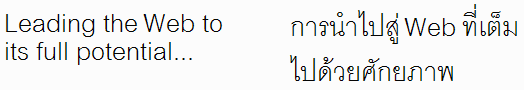

# Особенности локализации текста

**Для кого эта статья:** веб-разарботчики, менеджеры веб-проектов, специалисты по локализации, а также все, кто интересуется тем, как изменение длины текста при локализации влияет на дизайн страницы.

Обновлено 14 июня 2007 года, в 7:31

Когда текст переводится с одного языка на другой, длина оригинального и переведённого текста, вероятно, будет отличаться. Есть несколько ситуаций, в которых эти различия будут систематически повторяться.

В этой статье содержатся справочные материалы, описывающие некоторые из этих различий. В других статьях будут рассмотрено, какие последствия это несёт для разработки веб-страниц и преложены пути решения.

В общем, чем более гибкий макет вы создаёте, тем лучше. Разрешите тексту перетекать и избегайте маленьких фиксированных блоков или плотного их размещения везде, где это возможно. Будьте особоенно осторожны при точном позиционировании текста в макете. Разделяйте содержмое страницы и его представление таким образом, чтобы можно было легко адаптировать размеры шрифтов, межстрочный интервал и т.п. при переводе. Вы также должны помнить об этом при проектировании баз данных, во время задания длины текстовых полей.

## Больше всего проблем с английским и китайским

Тексты на аглийском и китайсоком, как правило, очень компактны, и перевод с этих языков будет, как правило, шире. Иногда значительно шире.

Например, недавно был переведён на несколько языков пользовательский интерфейс Flickr. Одно из самых распространённых сообщений, появляюещееся когда вы просматриваете свои фотографии - это количество просмотров. Например, «392 просмотра». Давайте сравним длину перевода слова «просмотр», относительно английского оригинала.

| Язык | Перевод | Отношение |
|-----:|---------|-----------|
| Корейский | 조회 | 0,8 |
| Английский | views | 1 |
| Китайский | 次 检视 | 1,2 |
| Португальский | visualizações | 2,6 |
| Французские | consultations | 2,6 |
| Немецко | -mal angesehen | 2,8 |
| Итальянский | visualizzazioni | 3 |

> Из-за большой ширины глифов, какждый символ на китайском или корейском считается за два символа в английском.

Увеличение длины текста до 300% в итальянском — обычное явление для коротких строк, подобных этой. В 1994 году IBM опбликовала «Руководстве по проектированию локализованных приложений», в которой приводятся следующие средние значения соотнешений длины перевода с английского для европейских языков (см. том 1 Руководства).

| Число символов в английском | Средне изменение длины |
|-----------------------------|------------------------|
| До 10 | 200-300% |
| 11-20 | 180-200% |
| 21-30 | 160-180% |
| 31-50 | 140-160% |
| 51-70 | 130-140% |
| Более | 70 150% |

В общем, как правило текст перевода занимает больше места, при этом чем меньше длина исходного сообщения, тем выше вероятность существенного увеличения длины перевода.

Конечно, это не все строки или сообщения увеличиваются в длине, но вы должны найти способ решить эту проблему, когда она возникнет. Например, Flickr переводит «FAQ» как «FAQ» в версии на немецком и французском, а в португальском как «Perguntas freqüentes» и «Preguntas frecuentes» на испанском.

Как правило, чем короче слово на английском, тем выше вероятность того, что перевод окажется «зажат» в тесном пространстве, например, рядом с полем формы или внутри графика, или во вкладке ограниченой ширины и т.д.

Имейте в виду, что расширение текста не является проблемой интерфейсов с оригинальным текстом на английском или китайском языках. Если исходное приложение на испанском языке, то термин «Idioma de la interfaz» будет короче на английском («Interface language»), но значительно длиннее на малайском языке («Bahasar pegantar untuk penelusuran»). Кроме того, более короткие строки перевода тоже создают проблемы, поскольку они создают избыточное пустое пространство на странице.

При переводе целых абзацев текста, относительное расширение, вероятно, будет меньше, но всё же могут возникнуть ситуации, на которые стоит обращать внимение. Например, вы сможете отобразить на «первом экране» все, что задумали? Будут ли элементы страницы по-прежнему выравнены так, как вы хотите, если блоки растут по высоте с разной скорость?

## Осложняющие факторы

Кроме непредсказуемости количества символов в переводе, есть и другие факторы, которые усложняют управление текстом в макете.

### Сочленённые существительные

В некоторых языках, таких как финский, немецкий и голландский, часто создаётся одно большое «слово», заменяющее последовательность из нескольких коротких слов на других языках.

Например, английское словосочетание «Input processing features» (Функции обрботки ввода) превращается в «Eingabeverarbeitungsfunktionen» на немецком языке. Текст на английском легко разбивается на две строки, если есть ограничение по ширине блока, например, рядом с полями ввода в форме, или на вкладках или кнопках, или в узких колонках. Немецкое «супер-слово» не может переноситься автоматически и может создать существенную проблему в макете.

### Ширина символа

Китайский, японский и корейский, а также некоторые другие языки, обладают более сложным написанием символов, чем языки, основанные на латининце. Это приводит к тому, что даже если число символов в строке перевода остаётся таким же, или даже становится чуть меньше, занимаемое строкой пространство может оказаться значительно больше, чем в оригинале.

Например, английское слово «desktop» превращается в «デスクトップ» на японском. Японский перевод меньше на один символ, но, как правило, занимает гораздо больше пространства по горизонтали.

### Высота символа и межстрочный интервал

Часто символы нелатинского текста оказываются намного выше, чем символы латиницы. Кроме того, особенности написания часто требуют большего межстрочного интервала.

Например, на рисунке ниже показан один и тот же текст на английском и тайском языках. Обратите внимание, в обоих случаях есть всего две строки, но вариант на тайском занимает гораздо больше места. Отчасти это связано со сложностью символов (это приводит к более высоким глифам, и, следовательно, увеличению высоты строки), но кроме того, в для тайского характерен больший интерлиньяж. Есть множество письменностей, для которых требуется гораздо больший межстрочный интервал, чем для латинского: арабский (особенно в начертании [Насталик](http://ru.wikipedia.org/wiki/%D0%9D%D0%B0%D1%81%D1%82%D0%B0%D0%BB%D0%B8%D0%BA)), китайский, деванагари (используется для хинди), японский, корейский, тибетский и др.

### Дважды подумайте, прежде чем использовать аббревиатуры

Когда вы используете сокращения, чтобы разместить текст в ограниченном пространстве, Вам следует серьезно подумать, действительно ли это хорошая идея? В других языках может не быть подобного сокращения, и текст перевода, возможно, будет значительно длиннее.

Во многих языках аббревиатуры — большая редкость. Это может быть вызвано стилем языка. В других случаях, это может быть вызвано практическими соображениями. Например, арабские «слова», как правило, построены на основе компактного корня с превиксами, суффиксами и небольшими внутренними изменениями, чтобы точнее отразить смысл. Сокращения без потери смысл становятся большой проблемой.

Кроме того, вам придётся познакомить переводчиков со списком используемых сокрщений и аббревиатур.